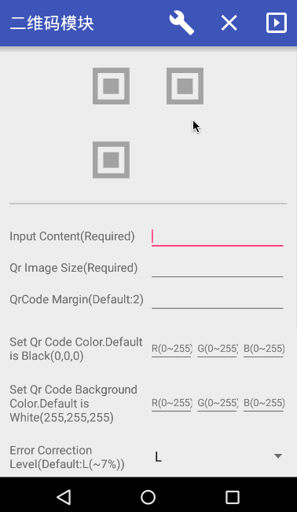

### Android QR Module


[](https://bintray.com/ydcool/maven/QrModule/_latestVersion)

> * Thanks to [Ryan_Tang][].本项目基于他[blog][]上的项目优化改进。
  * Feel free to fork and pr.

#### Features

* Qr Scan
* Qr Generate

##### QR Scan


###### Usage

1.  Add gradle dependence:

```java
    compile 'me.ydcool.lib:QrModule:lastest-intergration'
```

2.  Add  [QrScannerActivity][] to your `AndroidManifest.xml`

```xml
    <activity android:name="me.ydcool.lib.qrmodule.activity.QrScannerActivity"/>
```

3.  Add permissions

```xml
    <uses-permission android:name="android.permission.CAMERA"/>
    <uses-permission android:name="android.permission.FLASHLIGHT"/>
    <uses-permission android:name="android.permission.VIBRATE"/>
```

4.  Start `QrScannerActivity` in your activity.

```java
    Intent intent = new Intent(MainActivity.this, QrScannerActivity.class);
    startActivityForResult(intent, QrScannerActivity.QR_REQUEST_CODE);
```

5.  And receive scanner activity result in your activity.

```java
    @Override
    protected void onActivityResult(int requestCode, int resultCode, Intent data) {
        super.onActivityResult(requestCode, resultCode, data);
        if (requestCode == QrScannerActivity.QR_REQUEST_CODE) {
            Log.d(TAG, resultCode == RESULT_OK
                            ? data.getExtras().getString(QrScannerActivity.QR_RESULT_STR)
                            : "Scanned Nothing!");
        }
    }
```

See more details in Demo [MainActivity][].

##### QR Generate



###### Usage

* Generate qr code with [QrGenerator.java][].

```java
   Bitmap qrCode = new QrGenerator.Builder()
       .content("https://github.com/Ydcool/QrModule")
       .qrSize(300)
       .margin(2)
       .color(Color.BLACK)
       .bgColor(Color.WHITE)
       .ecc(ErrorCorrectionLevel.H)
       .overlay(getContext(),R.mipmap.ic_launcher)
       .overlaySize(100)
       .overlayAlpha(255)
       .overlayXfermode(PortBuff.Mode.SRC_ATOP)
       .footNote("Hello World!")
       .encode();

    mImageView.setImageBitmap(qrCode);
```

| Method | Description |
| ----- | ----- |
| `content(String content)` | content of qr code. |
| `qrSize(int size)` | qr code image size. |
| `margin(int margin)` | default is 2.See more about [EncodeHintType.MARGIN][] |
| `color(int color)` | qr code foreground color. |
| `color(Context c, @ColorRes int color)` | set foreground color with color resource. |
| `bgColor(int color)` | set the background color. |
| `bgColor(Context c,@ColorRes int color)` | set the background color with color resource. |
| `ecc(ErrorCorrectionLevel e)` | error correction level , default is `L` (~7%).See more about [ErrorCorrectionLevel][]. |
| `overlay(Bitmap overlay)` | overlay image on qr code, usually set with logo. _NOTICE: once you set overlay image,you'd better set `ecc` to `H`_. |
| `overlay(Context c,@DrawableRes int overlay)` | set overlay with drawable resource. | 
| `overlaySize(int size)` | overlay image size in qr code. |
| `overlayAlpha(int alpha)` |set overlay image alpha, range [0,255], default is 255(opaque). |
| `overlayXfermode(PorterDuff.Mode m)` | set xfermode for overlay bitmap,default is `SRC`,see more about [PorterDuff.Mode][]. |
| `footNote(String s)` | *This feature is under develop* . |
| `encode()` | return a encoded qrCode bitmap. |

#### TODO

* Custom pattern support.

#### License

Apache License 2.0
See the [LICENSE][] for more info.

[Ryan_Tang]:http://blog.csdn.net/ryantang03
[blog]:http://blog.csdn.net/ryantang03/article/details/7831826
[QrScannerActivity]:https://github.com/Ydcool/QrModule/blob/master/qrmodule/src/main/java/me/ydcool/lib/qrmodule/activity/QrScannerActivity.java
[MainActivity]:https://github.com/Ydcool/QrModule/blob/master/demo/src/main/java/me/ydcool/qrmodule/demo/MainActivity.java
[QrGenerator]:https://github.com/Ydcool/QrModule/blob/master/qrmodule/src/main/java/me/ydcool/lib/qrmodule/encoding/QrGenerator.java
[DemoGeneratorActivity]:https://github.com/Ydcool/QrModule/blob/master/demo/src/main/java/me/ydcool/qrmodule/demo/DemoGeneratorActivity.java
[LICENSE]:https://github.com/Ydcool/QrModule/blob/master/LICENSE
[EncodeHintType.MARGIN]:https://github.com/zxing/zxing/blob/master/core/src/main/java/com/google/zxing/EncodeHintType.java
[ErrorCorrectionLevel]:https://github.com/zxing/zxing/blob/master/core/src/main/java/com/google/zxing/qrcode/decoder/ErrorCorrectionLevel.java
[PorterDuff.Mode]:http://developer.android.com/reference/android/graphics/PorterDuff.Mode.html